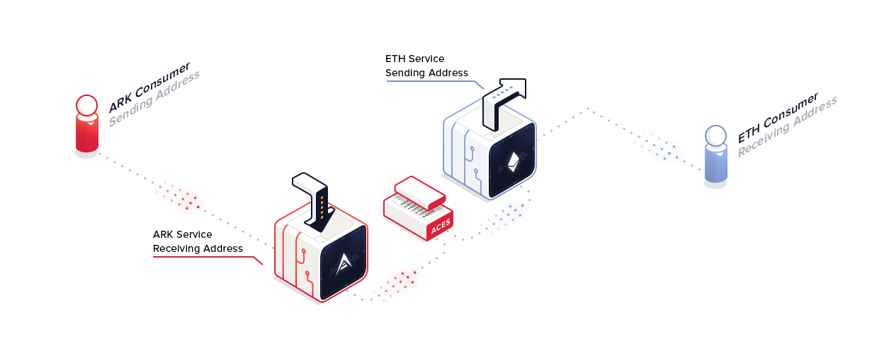

# Building an open-source blockchain ecosystem with ARK

<a href="https://www.linkedin.com/in/kristjankosic/"> @fa[id-card] Kristjan Kosic</a> <a href="https://www.ark.io"> @fa[firefox] ARK.io</a> <a href="https://github.com/arkecosystem"> @fa[github] github.com/arkecosystem</a>


---
### TODO - TOFU
- [ ] history
- [ ] cli-tools
- [ ] some-live-demo
- [ ] fat protocols
- [ ] web 2 web 3

---
### AGENDA
- History

---
### @fa[history] Looking back...
- Ten (10) years into **decentralisation** revolution
  - CyberPunks movement (Nick Szabo..)
  - Satoshi, Bitcoin birth, whitepaper


- Thru the phase of disillusionment (hype cycle)
  - Experimental solutions @fa[arrow-circle-right] Complete solutions
    - 1600 cryptocurrencies
    - <100 platforms or ecosystems

+++?image=assets/images/edonkey-emule.png
@title[eMule]
+++
### @fa[history] @fa[history] Looking back...
- Fat protocols aren’t new
- 1999: explosion of p2p file sharing technology
  - Gnutella (the protocol behind Limewire)
  - FastTrack (Kazaa)
  - eDonkey, and  eMule
  - BitTorrent

+++?layout:top-left&image=assets/images/current-web.png&position=right&size=40% 70%
### @fa[server] Internet Web 2.0
- Current shared protocols:
  - TCP/IP
  - HTTP/S
  - SMTP...

- **"THIN"** protocols
- **"FAT"** applications
- **VALUE in form of DATA**
- DATA processed in applications

+++?image=assets/images/web3.png&position=right&size=40% 70%
### @fa[server] Blockchain Web 3.0
- Inverted relationship
- VALUE concentrated at Protocol Level


- **"FAT"** protocols
- **"THIN"** applications

---
### @fa[history] The raw truth...
>Most projects will fail, but the **open-source nature** of the **ecosystem** means learnings and code will be available to all.

**We can learn and build faster than ever**.

---?image=assets/images/daftpunkocat.gif&position=center&size=auto 100%&color=white
@title[OSS-Intro]
+++
### @fa[osi] Open Source Software(OSS): Wave of the Future
- Cost reduction
- Quality improvement
- Quicker time to market
- Full ownership and control
- Drive innovation with rapid-pace
- No vendor lock-in
- More eyes on the code
- Integration and collaboration
- Community support (Live Help Desk)

+++
### @fa[osi] Open Source Software(OSS): Wave of the Future
- Survey by <a href="http://www.infosysblogs.com/infosysdigital/2016/06/open_source_software_wave_of_future.html">Black Duck Software [N: 1313]</a>
  - 78%  of enterprises run on open source
  - 65% companies are contributing to open source projects
  - 73% agree that git is the overwhelming choice for versioning
  - 90% Open source is the engine of innovation

+++
### @fa[osi] Open Source Software(OSS): Challenges
- Survey by <a href="http://www.infosysblogs.com/infosysdigital/2016/06/open_source_software_wave_of_future.html">Black Duck Software [N: 1313]</a>
  - 50% of companies haveno formal policy for choosing open source code
  - 47%  have no formal process in place to track open source code
  - 1/3 of companies have no process for identifying, tracking or remediating known open source vulnerabilities
  - 50% of OSS project have no license defined

+++
### @fa[osi] Open Source Software(OSS): Wave of the Future
- <a href="https://opensource.guide/">Opensource Guide/</a>

---
### Current challenges in blockchain space
- Interoperability @fa[hands-helping]
  - 1600 platforms
  - 100 ecosystems

- Regulation
- Complexity (end-users)
- Speed of processing

---?image=assets/images/ark-bg.jpg
@title[ARK]
---
### WHAT IS ARK?
> Ark aims to create an entire ecosystem of linked chains by providing easy to use tools to deploy your own blockchain.

- ARK is Open-Source
- Highly flexible and adaptable
- DPOS Consensus Mechanism (3rd generation)

---
### OPENSOURCE SOFTWARE DEVELOPMENT
- opensource.guide
- opisi koraki procesa in vkljucevanja
---

### HOW DO WE USE OSS TOOLS AT ARK
- cli vmesniki
---

### ARK CORE v2 WAS RELEASED
- why
- what
- modular/pool/plugins/latest standard.. with one goal..
- bounties again
-
---

### ACES

- Ark Contract Execution Services
- Project by ARK Community members
- The Blockchain Interoperability Platform
- Provides protocol and tools for building blockchain service marketplace
- Chain independent

---

### SO WHAT IS ACES?

Consists of:

- Marketplace
- Services
- Listeners

---

#### MARKETPLACE

A Web Application for searching and executing ACES Service contracts and tracking contract
executions.


---

#### SERVICES

ACES Services create and execute Service Contracts, which can be anything from uploading a file to
a storage blockchain, performing value transfers, creating smart contracts, executing code on
blockchain based computing platforms, or interacting with IoT hardware.

Services request information from listeners to confirm whether their requirements have been
fulfilled. The service provider does not need to run a listener of their own.

Example services:
- ARK->ETH channel service: http://bit.ly/ark-2-eth
- ETH->ARK channel service: http://bit.ly/eth-2-ark
- ARK->ETH contract service: http://bit.ly/ark-2-eth-contract

---

#### LISTENERS

The ACES Listener API provides a way for all the different blockchain transaction events to be
easily consumed via a common REST-FUL API. It's the component that plugs into a blockchain
(eg. Bitcoin) and provides standardized API access for ARK services to receive data from a
blockchain. The listener stands on its own, and does not necessarily need to be run by the same
person running a service.

Docs: https://ark-aces.github.io/aces-listener-docs/

Example listeners:
- BTC listener: http://bit.ly/aces-btc-listener
- ARK listener: http://bit.ly/aces-ark-listener
- ETH listener: http://bit.ly/aces-eth-listener

---

### WHAT CAN YOU DO WITH ACES?

- Make transaction on any\* chain without holding its coin
- Deploy ETH contracts without holding ETH
- Execute functions on ETH without holding ETH
- Run an ICO (receive ETH, ARK, BTC,...)
- Service Linking: BTC to ETH (via ARK)

\*Currently there are services for ARK~ETH, ARK~BTC, ARK~PRS, ARK A~ARK B

---
### How it work

#### 1. ETH -> ARK



---
### How it work

#### 2. Service Linking

The design of listeners and services enabled an option to easily link services together.


---

### LET'S SETUP UP ARK TO ETH SERVICE IN 3 STEPS


I'll be showing you on the example of my Docker setup. Source can be found here: https://github.com/deadlock-delegate/aces-ark-eth-demo

---

#### Step 1: Clone ARK ~ ETH repository

```
git clone git@github.com:deadlock-delegate/aces-ark-eth-demo.git
cd aces-ark-eth-demo/
```

---?gist=roks0n/4950d97bb197394ae8bb579a9e8c91cf&lang=Scala

#### Step 2: Change settings in docker-compose.yml

@[8-15]
@[27-33]

---

#### Step 3: Start the project

```
docker-compose up
```

---

### Other CONTENT

- Official ACES Github: https://github.com/ark-aces (primarily in Java)
- Official ACES blog: https://medium.com/@arkaces
- ACES Listener docs: https://ark-aces.github.io/aces-listener-docs/
- ARK->PRS, ARK->KAPU: https://github.com/galperins4/PythAces (Python)
- Official ACES marketplace: https://marketplace.arkaces.com/

---
